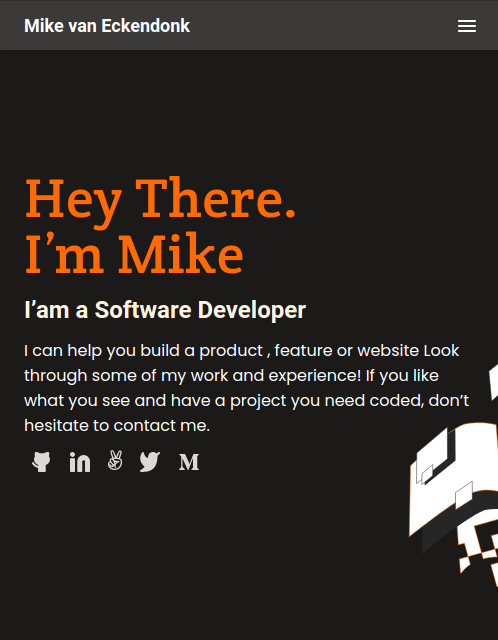

# Project Name : Portfolio

This is the Portfolio of Mike van Eckendonk as a page to show all the work he did.

This repo is an almost exact copy of the template that is hosted on figma.com. You can find the template here:

https://www.figma.com/file/l7SqJ3ZfkAKih9sFxvWSR4/Microverse-Student-Project-1?node-id=48%3A27

This is a mobile version of the figma template 2 and has many pages.
I used VScode as my editor and created the files needed for this project



Additional description about the project and its features.

## Built With

- HTML 
- CSS
- VScode
- Git & GitHub
## Live Demo link

[Live Demo Link](https://mrEckendonk.github.io/portfolio/)


## Getting Started

**This is an example of how you may give instructions on setting up your project locally.**
**Modify this file to match your project, remove sections that don't apply. For example: delete the testing section if the currect project doesn't require testing.**


To get a local copy up and running follow these simple example steps.

### Prerequisites
have a working git on your localmachine.
## Install
To get a working local copy up and running follow these simple steps
- open terminal
- clone this project with the command:


```
$ git clone https://github.com/mrEckendonk/Portfolio.git
```
- Finally, run the next command in the terminal to see the web app in your local browser, or also, you can use Live Server in Visual Studio Code.
```
$ npm start
```
### Usage
For anyone that whats to learn html & css & javascript, this is a great place to start.
### Run tests
N/A
### Deployment
N/A


## Author

👤 **Author**

- GitHub: [@Eckybrazzz](https://github.com/mrEckendonk)
- Twitter: [@twitterhandle](https://twitter.com/mike_eckendonk)
- LinkedIn: [LinkedIn](https://www.linkedin.com/in/mike-van-eckendonk)

## 🤝 Contributing

Contributions, issues, and feature requests are welcome!

Feel free to check the [issues page](https://github.com/mrEckendonk/Portfolio/issues).

## Show your support

Give a ⭐️ if you like this project!

## Acknowledgments

- Hat tip to anyone whose code was used
- Inspiration 💘
- Microverse program ⚡
- My standup team 🏹
- My family's support 🙌

## 📝 License

This project is [MIT](./MIT.md) licensed.